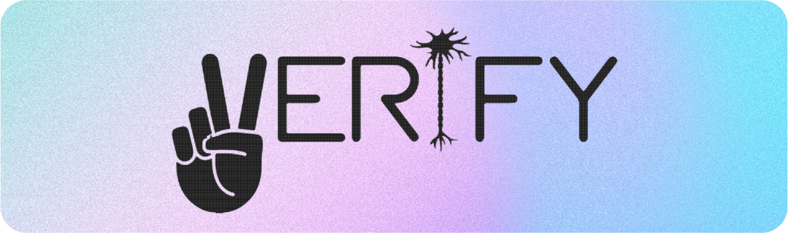
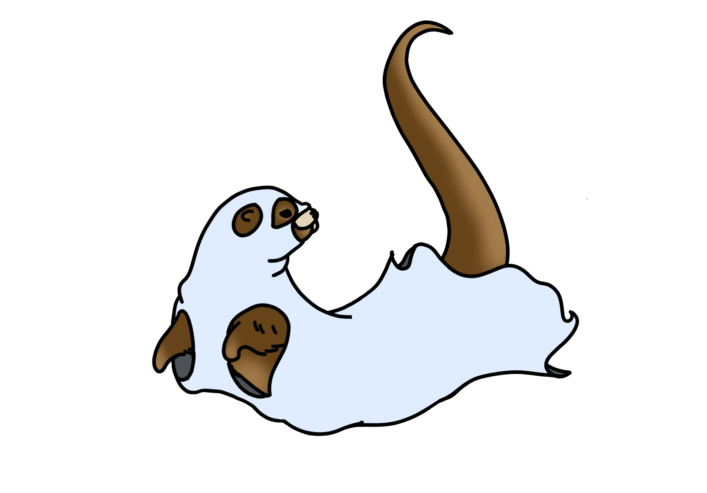

# OTTER: Online TMS Training Experience Reboot

TMS Training Quizzes is an innovative quiz platform that facilitates the learning experience of clinicians who are a part of the VERIFY study handling TMS equipment to determine the prognosis of stroke patients.

## Project Description
The OTTER project has been to develop a new learning platform for clinicians using TMS (Transcranial Magnetic Stimulation) on stroke patients. The platform allows clinicians to take quizzes and become certified when using TMS. It allows for practice and final attempts over 6 modules and a recertification module for each clinician to complete each year. Previously clinicians have been completing these quizzes on Google Forms, but the client wanted a dedicated solution for the quizzes to provide better insights into the quiz attempts and automatic certifications. Following an attempt, clinicians are able to view feedback about specific answers, and what they should revise before attempting the quiz again. Admins can add and edit quiz questions and can upload images to support the question. They can also view statistics about quiz attempts, and view results from each clinician's profile including their certifications and certificates.

> [Demonstration Video](https://youtu.be/IDDmtNcA6Jw)

> [Project Management Tool (Jira)](https://lucasfetavares.atlassian.net/jira/core/projects/GC/board)

## Technologies Used
* .NET 8
* Microsoft SQL Server
* React JS
* Figma
* Amazon Web Services
* GitHub
* Jira

### React library
```

  "dependencies": {
    "@fortawesome/free-solid-svg-icons": "^6.5.2",
    "@fortawesome/react-fontawesome": "^0.2.0",
    "@ionic/react": "^8.0.1",
    "fortawesome": "^0.0.1-security",
    "react": "^18.2.0",
    "react-dom": "^18.2.0",
    "react-helmet": "^6.1.0",
    "react-router-dom": "^6.22.3",
    "react-textarea-autosize": "^8.5.3",
    "react-tooltip": "^5.26.4",
    "redaxios": "^0.5.1"
  },
  "devDependencies": {
    "@types/react": "^18.2.56",
    "@types/react-dom": "^18.2.19",
    "@vitejs/plugin-react": "^4.2.1",
    "autoprefixer": "^10.4.19",
    "eslint": "^8.56.0",
    "eslint-plugin-react": "^7.33.2",
    "eslint-plugin-react-hooks": "^4.6.0",
    "eslint-plugin-react-refresh": "^0.4.5",
    "postcss": "^8.4.38",
    "react-css-modules": "^4.7.11",
    "tailwindcss": "^3.4.3",
    "vite": "^5.2.11"
  }

  ```

### .NET NuGet Packages
```
AWSSDK.Core - v3.7.304.5
AWSSDK.S3 - v3.7.308.4
AWSSDK.SimpleEmail - v3.7.300.95
BCrypt.Net-Next - v4.0.3
iTextSharp - v5.5.13.3
Kralizek.Extensions.Configuration.AWSSecretsManager - v1.7.0
Microsoft.AspNetCore.Authentication.JwtBearer - v8.0.5
Microsoft.AspNetCore.OpenApi - v8.0.5
Microsoft.EntityFrameworkCore.Design - v8.0.5
Microsoft.EntityFrameworkCore.SqlServer - v8.0.5
Microsoft.EntityFrameworkCore.Tools - v8.0.5">
Microsoft.IdentityModel.Tokens - v7.5.2
Swashbuckle.AspNetCore - v6.6.2
Swashbuckle.AspNetCore.Annotations - v6.6.2
Swashbuckle.AspNetCore.Filters - v8.0.2
System.IdentityModel.Tokens.Jwt - v7.5.2
```

## Project Installation Instructions

### Front End
* Install Visual Studio Code
* Install Node.js (https://nodejs.org/en)
* Open project in Visual Studio Code
* In a new terminal, run `cd (path to Front End folder)`
* Run `npm install` in the terminal. This will download all of the dependencies stated in the package.json file.
* Run `npm run dev` in the terminal. This will then run the code on your local device and give a link which you can put in your browser to view the project. 


### Back End
* Install .NET 8
* Install Visual Studio 2022
* Open `OTTER.sln` file from within `Back End/OTTER`
> **_NOTE:_**  After opening the project in Visual Studio, you can run the program in a developer environment, however you may not have access to any services through AWS such as S3, Simple Email Service, or Database.
* To deploy, use AWS Explorer plug-in in Visual Studio and deploy to Elastic Beanstalk. You may also deploy to your own server.

### Google Apps Script
For pre-training survey to send email address to backend upon submission

* Copy the contents of the [PreSurveyFormSubmissionAppsScript.gs](PreSurveyFormSubmissionAppsScript.gs) file
* Open a new Google Apps Script project
* Paste the contents of the PreSurveyFormSubmissionAppsScript.gs file into the Code.gs file in the project
* Add the Google Form ID for the pre-training survey into the formID variable
* Run the setTriggers function in Apps Script to set the responseReceived function to run on form on form submit

When a form submission is received, the responseReceived function will send the email address to the TMS Training Quizzes back end to mark user as completing the pre-training survey.

## Usage Examples
Our platform is designed for use by clinicians training on how to use TMS on stroke patients. It is not intended for public use.

The clinicians can sign up and complete the quizzes for each module.

Admins can login and view clinicians, their statistics, edit quizzes, and edit settings.

## Website URL
[TMS Training Quizzes (tmstrainingquizzes.com)](https://www.tmstrainingquizzes.com/)

## Future Release Ideas

### Recalling Attempt Feedback and Better Statistics

Adding the ability for admins and clinicians to go back and see past attempts, including the specific answers they got right and wrong. Currently the only data that is stored is whether the attempt was pass or fail.

### Automatic Quiz Reminder Emails

At the moment, clinicians and admins would have to login to check if they need to take the recertification quiz or make a note of the current expiry date elsewhere to remember to come back. This can be resolved by adding an automatic reminder email that is sent 11 months after their existing certification expiring alerting them to come back and attempt the recertification quiz.

### Screen Size Adaptability

Accessing the site at the moment is best done via a computer, as some pages do not scale correctly or collapse menus nicely when viewing the site on a mobile device. Adding mobile and tablet support will give clinicians and admins more freedom to access the site on whatever device they would like.

### Advanced Answer Types

As part of our initial design ideas, we thought about adding a drag-and-drop question type, which would allow clinicians to answer a question by dragging possible answers onto an image or template sentence. This was not a feature we were able to build with the time constraints we had, but it would potentially be a good addition to the site at a later point.

### Survey Integration

Clinicians currently have to complete their pre and post-training surveys on Google Forms, and then return to our site. In the future, integrating these surveys into the website would mean that the whole learning assessment process would be hosted from TMS Training Quizzes.

## Acknowledgments

Thank you to our clients Cathy Stinear, Harry Jordan, and Ben Scrivener for the opportunity to work with them on this innovative solution.

## Contributors



Brought to you by Ghost Code (Team 3) | University of Auckland - Computer Science Capstone (Semester 1, 2024)

* Lucas Fernandes Tavares - Team Leader/Front-end
* Ayesha Essop - Co-Leader/Front-end
* Sahil Kumar - Front-end/Back-end
* Angus Wright - Back-end
* Bailey Alexander - Back-end
* Emily Zhao - Front-end
